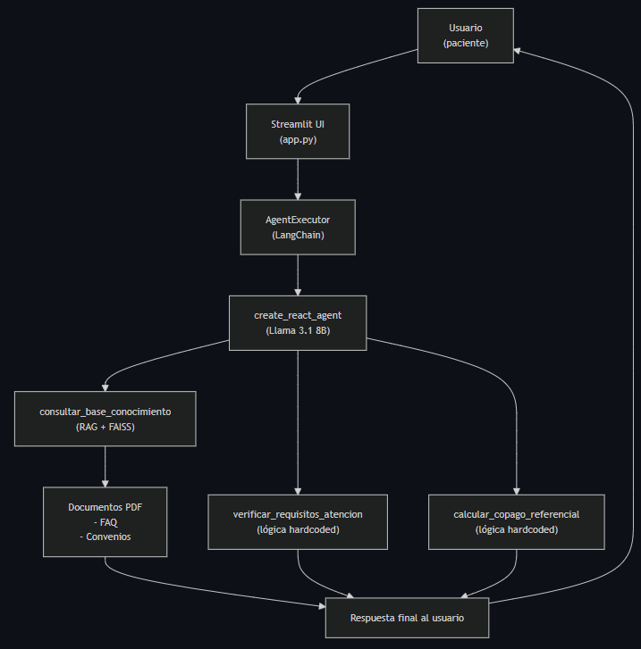

# 🏥 Asistente Virtual Inteligente - Clínica de Salud

## 📋 Descripción General

Este proyecto implementa un **asistente virtual inteligente** para una clínica de salud, diseñado para responder de forma automática, precisa y amable las consultas más frecuentes de los pacientes.

El agente utiliza **Inteligencia Artificial Generativa** combinada con **Recuperación Aumentada por Generación (RAG)** para acceder a información institucional actualizada (FAQs, convenios, políticas) y generar respuestas contextuales, evitando alucinaciones y derivando a canales humanos cuando la información no está disponible.

### 🎯 Objetivos del proyecto

- 🚀 Automatizar respuestas a consultas frecuentes de pacientes (turnos, requisitos, coberturas).
- 💰 Reducir la carga operativa del personal de recepción.
- ⚡ Ofrecer respuestas rápidas (3-5 líneas) optimizadas en consumo de tokens.
- 🔒 Minimizar alucinaciones mediante RAG con FAISS y prompts estrictos.
- 📱 Proveer una interfaz web amigable con Streamlit.

---

## 🏗️ Arquitectura de la Solución

### Diagrama de flujo


  
### Componentes principales

1. **Frontend (Streamlit)**: Interfaz web con acciones rápidas y chat libre.
2. **Agente React (LangChain)**: Orquesta el razonamiento y decide qué herramienta usar.
3. **LLM (Groq + Llama 3.1 8B)**: Modelo rápido y eficiente para generar respuestas.
4. **Vectorstore (FAISS)**: Almacena embeddings de los documentos para búsqueda semántica.
5. **Herramientas especializadas**:
   - `consultar_base_conocimiento`: RAG sobre los documentos institucionales.
   - `verificar_requisitos_atencion`: Checklist según modalidad (convenio/particular).
   - `calcular_copago_referencial`: Estimación de valores según especialidad.

---

## 🛠️ Tecnologías y Herramientas Utilizadas

| Tecnología | Versión | Propósito |
|---|---|---|
| **Python** | 3.11+ | Lenguaje base del proyecto |
| **LangChain** | 0.3.22 | Framework para orquestar agentes y RAG |
| **LangChain-Groq** | 0.3.2 | Integración con el LLM de Groq |
| **Groq API** | - | Infraestructura rápida para Llama 3.1 8B |
| **Llama 3.1 8B Instant** | - | Modelo de lenguaje generativo |
| **FAISS** | - | Búsqueda vectorial de similitud |
| **Sentence-Transformers** | - | Generación de embeddings multilingües |
| **PyPDF** | 5.4.0 | Extracción de texto de documentos PDF |
| **Streamlit** | 1.44.1 | Framework de interfaz web |
| **Python-dotenv** | 1.0.1 | Gestión de variables de entorno |

---

## 🚀 Instrucciones para Ejecutar el Proyecto

### 1. Clonar o crear el proyecto

```bash
mkdir consultorio-ia
cd consultorio-ia
```

2. Crear un entorno virtual
   
```bash
python -m venv .venv
.venv\Scripts\activate    # Windows
source .venv/bin/activate # Linux/Mac
```

3. Instalar dependencias
Crea un archivo requirements.txt E instala:

```bash
pip install -r requirements.txt
```
4. Configurar variables de entorno
Crea un archivo .env en la raíz del proyecto:

```env
GROQ_API_KEY=tu_clave_groq_aqui
```

7. Ejecutar la aplicación
```bash
streamlit run app.py
```
La aplicación se abrirá automáticamente en tu navegador en http://localhost:8501.

## 💬 Ejemplos de Preguntas que el Agente Puede Responder

### 📅 Turnos y Agenda

- "¿Con cuánta anticipación debo pedir turno para cardiología?"
- "¿Qué pasa si llego tarde a mi turno?"
- "¿Puedo cancelar mi turno el mismo día?"
- "¿Atienden urgencias sin turno previo?"

### 💳 Coberturas y Pagos

- "¿Qué obras sociales aceptan?"
- "¿Atienden por OSDE?"
- "¿Cuánto cuesta la consulta con un especialista?"
- "¿Cómo puedo pedir un reintegro?"

### 📋 Requisitos

- "¿Qué documentos debo llevar a mi consulta?"
- "¿Necesito orden médica para dermatología?"
- "¿Qué pasa si no tengo obra social?"

### 🏥 Información General

- "¿Cuáles son los horarios de atención?"
- "¿Dónde está ubicada la clínica?"
- "¿Tienen servicio de WhatsApp?"

---

## 🤖 Ejemplos de Respuestas Generadas por el Agente

### Ejemplo 1: Pregunta sobre turnos

**Pregunta del usuario:**

> "¿Con cuánta anticipación debo pedir turno para cardiología?"

**Respuesta del agente:**

> Para especialidades como cardiología, se recomienda agendar con **1 a 2 semanas de anticipación**, ya que la disponibilidad suele ser menor que en medicina general.
> 
> Puedes solicitar tu turno a través de nuestro portal web, WhatsApp oficial (+54 9 11 1234-5678) o llamando a la central telefónica (011) 4567-8900.

---

### Ejemplo 2: Pregunta sobre requisitos

**Pregunta del usuario:**

> "¿Qué documentos debo llevar si me atiende por Swiss Medical?"

**Respuesta del agente:**

> 📋 **Requisitos para atención por convenio:**
> 
> 1. DNI o pasaporte vigente.
> 2. Credencial digital o física de Swiss Medical (con el plan visible).
> 3. Orden médica autorizada (solo si la especialidad o estudio lo requiere previamente).
> 
> Sin estos documentos no podremos brindarte la atención bajo cobertura.

---

### Ejemplo 3: Pregunta sobre copagos

**Pregunta del usuario:**

> "¿Cuánto sale la consulta con un neurólogo?"

**Respuesta del agente:**

> 💰 **Copago referencial para consulta de especialidad:** El valor estimado es entre **$4.000 y $8.000 ARS**, dependiendo del plan de tu obra social o medicina prepaga.
> 
> ⚠️ Este valor es orientativo. El copago exacto se confirma al momento de la admisión según tu plan específico.

---

### Ejemplo 4: Pregunta fuera del alcance

**Pregunta del usuario:**

> "¿Tienen estacionamiento propio?"

**Respuesta del agente:**

> No tengo esa información específica en mi base de datos. Te sugiero contactar a recepción al **(011) 4567-8900** o por WhatsApp al **+54 9 11 1234-5678** para confirmar este detalle. ¡Con gusto te atenderán!

---

## 📊 Optimizaciones Implementadas

|Aspecto|Implementación|Beneficio|
|---|---|---|
|**Tokens limitados**|`max_tokens=300` en el LLM|Respuestas cortas, menor costo en Groq|
|**Embeddings locales**|`sentence-transformers` multilingüe|Sin dependencia de APIs externas|
|**Chunking inteligente**|Separador por pregunta (`\n\n¿`)|Cada chunk = 1 pregunta + 1 respuesta|
|**Caché en Streamlit**|`@st.cache_resource`|Vectorstore se carga una sola vez|
|**Retrieval limitado**|`k=2` en FAISS|Solo se envían 2 chunks al LLM|

---

## 📝 Licencia

Este proyecto fue desarrollado con fines educativos y de demostración.
